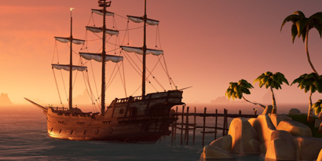
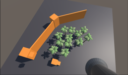
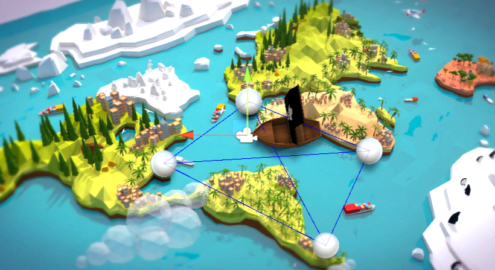
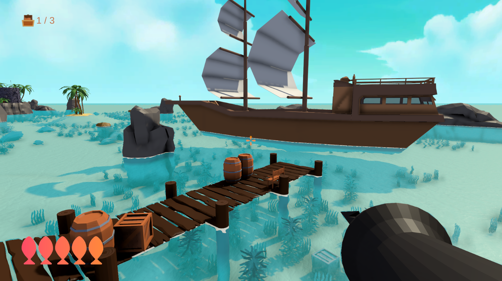
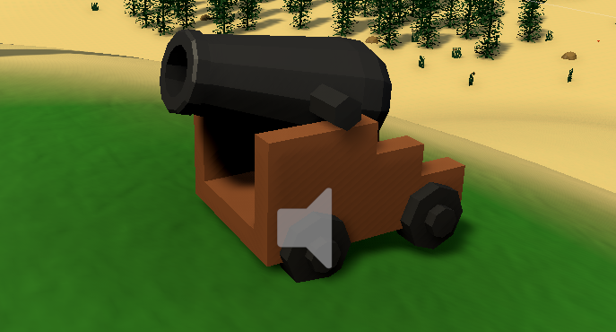
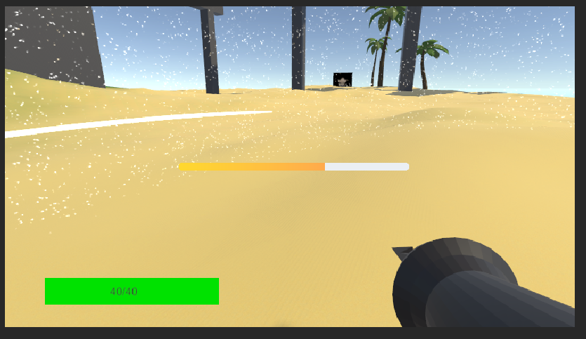
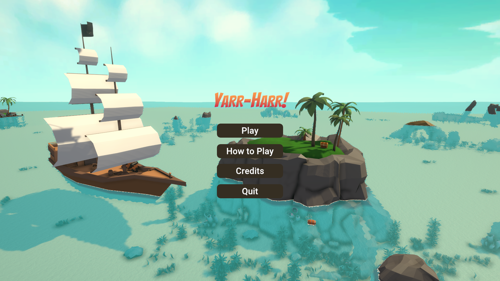
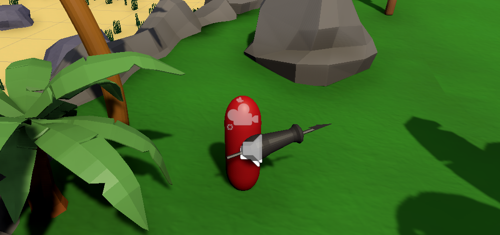

*It could be a bit bullshit but also kind of records.*

Members of group 4:
- Erik Westergren   ewesterg@kth.se
- Kok Siang Ng      ksng@kth.se
- Max Truedsson     maxtru@kth.se 
- Ao Xu             aox@kth.se
- Zezhe Huang       zezhe@kth.se

## Brainstorms

We are going to design a game with a proper Game Design Document(GDD).

At the very first brainstorm of the ideas, we wrote lots of genres and themes we like and played before. Besides the popular ones such as platformer, rogue-like, fantasy and sci-fi, we are stuck to come up with more game types. It would be better to have a reference at such a time.

Useful links:
- Game genres: https://www.gamedesigning.org/gaming/video-game-genres/
- Game themes: https://backtogames.com/pages/game-themes

In addition to the game itself, we also talked about the technical stuff, which was finally determined to be a combination of Unity, Git and Blender. We all have more or less experience of making a game with different frameworks or engines, but it sould be quicker for us to use a widely-used one because of tons of accessible [learning resources](https://learn.unity.com/) and [game assets](https://assetstore.unity.com/).

Finally, we had our idea with a background of pirates - ***Yarr-Harr!***. (There is Scandinavia, isn't it? :D) It would be rouge-like first-person game with the main mechanics of harpooning, which is possible to grasp something, pull the character towards the grasped thing, as well as attack enemies. To enrich the game, types of terrains, enemies, chests and types of levels (exploring combats or puzzles) would be designed.

## Rough Skeleton

Before the proposal presentation, we already had a simple prototype as shown above with cubes, trees, the harpoon and a cylinder as the character. So when I got started, I picked the missing part - the level hub but it played an important role as a connection among different level scenes.

With free models and map image found online, I put a plane with the image as texture, and put the boat model so that the player can control it to choose different levels. In technical aspect, it was not quite difficult to implement with the help of tutorials, which inspired me to create a simple sphere as a prefab for the level pins. Indicating user inputs for movements and level selections, the level hub could work with the minimal implementation.

Then we had all the basic seperate scenes: basic puzzle scene, a level hub scene. To cascade scenes together, at lease we needed:
- a main menu to start with,
- loading scenes from the level hub, 
- and a pause menu in level scenes.

It was nice that we could easily find related tutorials to follow and create simple menus without fancy styles. Game starts with the main menu, which leads to further optional settings, the level hub or quitting the game. For the pause menu, a game object with scripts detected the input of <kbd>Esc</kbd> to transit to the transparent menu, which allows players to go back to the level hub or the main menu.

Tutories I took:
- Level selection: https://bigbad.xyz/blog/how-to-make-a-level-select-like-in-super-mario-world
- Start menu: https://www.youtube.com/watch?v=zc8ac_qUXQY
- Pause menu: https://www.youtube.com/watch?v=JivuXdrIHK0&t=435s

## Just Do It

Basically, some proper menus, a tutorial level, transitions among different scenes, music and a save system were agreed and written down in the task list. With the basic flow of the game, what we had to think about is how the level should be designed. Should we provide combat with enemies, puzzles or a mini fishing game to make the progress more relaxing? We couldn't make a decision immediately, so we just followed whatever ideas we had and implemented them.

Some of us started working on the tutorial level, which helps players to get familiar with the grappling mechanics, while others created lots of models and prefab like greens, bridges, rocks, dangers, the interatable buttons and orbs, etc. 

(The above screenshot is the final version of tutorial level.)

Interestingly, the cannon I made with the ability to aim the player automatically became my largest challenge in the tutorial level. It sucks but it is also sweet :)

Before our modified cannon model was finished, I found a lot of free cannon models in [this asset](https://assetstore.unity.com/packages/3d/props/weapons/stylish-cannon-pack-17), which is super useful for game developing beginners who couldn't make their own models. At first, I had no idea about how I could make a cannon, which could fire and cause damages. Progress were made after I had a look at an [asset](https://assetstore.unity.com/packages/3d/environments/fantasy/goblin-cannon-145437) with the similar function as we want.

There is an invisible zone in the cannon prefab, within which the character will be tracked and shot by cannon bullets. 

For the save system, even though I had an initial idea of how the data should be structured, I never wrote similar codes in C-sharp. The tutorials came again. The saving and loading could work everywhere with static functions. Similarily, to help manage all music in a game object, which won't be destroyed, scripts of a general manager was needed. With each scene loaded, the configuration of background music should be detected and played automatically (if existed). The part of audio manager is common on games, so I directly modified the version of Brackeys to our current one.

YouTube tutorials:

- SAVE & LOAD SYSTEM in Unity https://www.youtube.com/watch?v=XOjd_qU2Ido&t=873s
- Introduction to AUDIO in Unity https://www.youtube.com/watch?v=6OT43pvUyfY&t=641s

## Connect and Refine Everything

We finished most of key functions at the intermediate stage. However, lights were monotonous and GUIs were too simple. The player even had to evoke pause menu to save progress, which could be done everywhere :/ 

Because I created the original basic (naked) UI of menus, absolutely I had the respondibility to refine it. Considering that it could be tedious task to build a nice button with a tons of decoration: border, shader, lighting, hover effects, click effects, sound effects, etc., I decided to use a GUI package, which was [Clean & Minimalist GUI Pack](https://assetstore.unity.com/packages/2d/gui/clean-minimalist-gui-pack-75123). Everything became much direct that what we needed to do was to define the callback of click event, decide a theme palette and move the GUI elements to proper positions. The package was super nice that we could even use a scene transition script built in it. To utilize complex elements like the progress bar, I wrote some public functions to control the transform of the game object so that we could simply call it to set the percentage of progress bar, which was used in saving progress (hold E 2 seconds save). 

Also, we didn't want the saving more limited at specific locations. For this purpose, the particle system built in Unity - Visual Effect Graph came in. I really liked it since it was super easy to edit the particles with a bunch of properties: textures, randomization, colors... Our save point was born from the particle system.

What's more, although most of things could be used directly in the scenes, some models were just dumb objects without any interaction. Let's say, the chests. To enable the opening animation when the player opens a chest, I reconfigured the animation controller with trigger conditions, so that the condition could be set in the script of interaction.

## Final Delivery

All the levels were polished at the last minutes, which means we had to test through the whole game in a short time. Fortunately, almost found bugs were the one easy to solve.

## GOODBYE, YARR-HARR!

- Unity assets flexibly helped a lot.
- YouTube tutorials helped a lot. Thank [Brackeys](https://www.youtube.com/c/Brackeys)!
- It would be cool if a game developer can also model and make music. Or, if the team is able to do. XD
- Developing complete stuff working individually in every stage guaranteed the progress and integrality, even though we had to keep changing and improving details.

*Who knows the handsome pirate captain is actually a cylinder? 😎*

